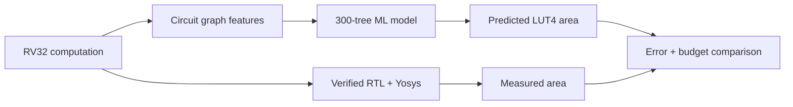

# ISAForge

Predict FPGA area for RISC-V custom instructions, then check the hardware tradeoff before adding them to a CPU.


```mermaid
flowchart LR
    A[RV32 computation] --> B[Circuit graph features]
    B --> C[300-tree ML model]
    C --> D[Predicted LUT4 area]
    A --> E[Verified RTL + Yosys]
    E --> F[Measured area]
    D --> G[Error + budget comparison]
    F --> G
```

| Model | Validation | Hardware |
| --- | --- | --- |
| 217 features · 1,665 training circuits | Matched benchmarks and saved inference | PicoRV32 integration and instruction fusion |
| Pretrained ExtraTrees regressor | RTL checks and synthesis labels | Cycles, LUTs and routed frequency |

## Quick start

```sh
git clone https://github.com/jas0nriverah/agentic-riscv-codesign.git
cd agentic-riscv-codesign
./start.sh
```

Creates a local Python environment → installs pinned dependencies → verifies model and benchmark hashes → runs 32 real predictions. Requires Python 3.11+ and network access for the first install; subsequent runs work offline. No FPGA tools or retraining needed for this demo.

| Command | Action |
| --- | --- |
| `./start.sh` | Verify and run the inference demo; save outputs under `generated/start/` |
| `./start.sh --check` | Check the environment and saved evidence without installing or writing |
| `./start.sh --test` | Run the full test suite, then the demo |

## Example

Estimate the area of `(in0 XOR in1) × 31`:

```text
Formula                              Predicted LUT4   Measured LUT4
mul(xor(in0,in1),addi(0,31))                  235.02             202
```

The prediction comes from the saved model; the measured value is a retained Yosys result. Predictions are estimates, not guarantees that a circuit fits a hardware budget.

## Results

Same **192 synthetic test circuits**, same **1,665 training circuits**, same measured FPGA target:

| Predictor | MAE ↓, LUT4 | MAPE ↓ |
| --- | ---: | ---: |
| **ISAForge base** | **32.16** | **43.63%** |
| Dual-graph control | 34.33 | 49.37% |
| Tuned operator-graph model | 46.34 | 75.63% |
| MasterRTL recipe adaptation | 61.47 | 85.67% |

MAPE compares each prediction with **measured LUT4 count**; it excludes six zero-area circuits, which remain in MAE. The MasterRTL row is our FPGA adaptation, not the paper's ASIC result. [Benchmark definitions](docs/benchmarks.md).

**Status:** runnable research software. The base model remains the default; newer budget classifiers failed safety checks and are not promoted. CPU-performance measurements are a separate, provisional hardware track. [Results and limitations](results/README.md).

## Documentation

| I want to… | Guide |
| --- | --- |
| Understand the model | [Model pipeline](docs/model.md) |
| Run inference or troubleshoot setup | [Operations](docs/reproduce.md) |
| Understand MAPE and compare results | [Benchmarks](docs/benchmarks.md) · [Results](results/README.md) |
| Build and measure a custom instruction | [Hardware track](hw/README.md) |
| Contribute or reproduce an experiment | [Development](CONTRIBUTING.md) · [Research records](results/README.md#experiment-records) |
| Reuse code or cite the project | [Attribution and licensing](docs/reuse.md) |
